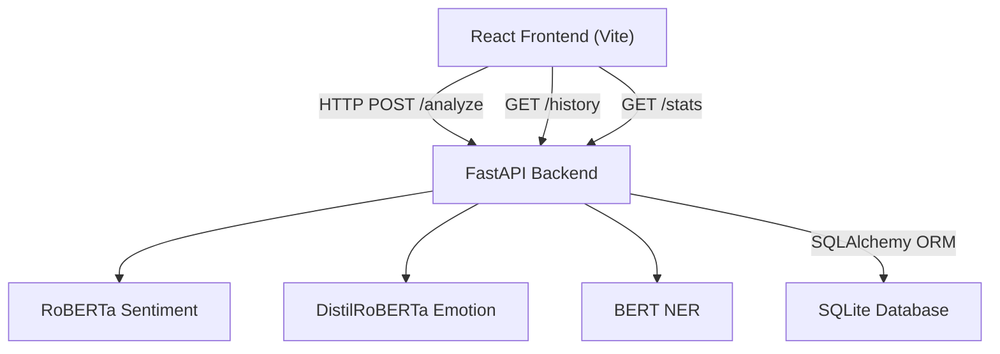

# AI Sentiment Analyzer

🔴 **Live Demo:** [ai-sentiment-analyzer-tau.vercel.app](https://ai-sentiment-analyzer-tau.vercel.app/)

> A full-stack, real-time sentiment analysis application powered by **HuggingFace Transformers**.

[](https://fastapi.tiangolo.com)
[](https://react.dev)
[](https://huggingface.co)

## 🚀 Features

- **Sentiment Analysis**: Positive, Negative, or Neutral classification using RoBERTa.
- **Emotion Detection**: Multi-label emotion detection covering 7 emotions (joy, sadness, anger, fear, surprise, disgust, neutral).
- **Named Entity Recognition (NER)**: In-line highlighting of Persons, Organizations, Locations, and Misc entities.
- **Persistent History**: All analyses are stored in a local SQLite database for future reference.
- **Analytics Dashboard**: Interactive Doughnut charts showing sentiment and emotion distributions over time.
- **Modern UI**: A responsive, dark glassmorphism interface.

## 🏗️ Architecture



## 🛠️ Running Locally

### Prerequisites
- Python 3.9+
- Node.js 18+

### 1. Start the Backend

```bash
cd backend
pip install -r requirements.txt
python -m uvicorn main:app --reload --host 0.0.0.0 --port 8000
```
*(Note: The first time you run this, it will download ~600MB of model weights. Subsequent runs will be instant.)*

### 2. Start the Frontend

In a new terminal window:
```bash
cd frontend
npm install
npm run dev
```

Open `http://localhost:5173` in your browser.

## 📁 Project Structure

```
ai-sentiment-analyzer/
├── backend/
│   ├── main.py        # FastAPI application & API endpoints
│   ├── models.py      # HuggingFace pipeline loader
│   ├── database.py    # SQLAlchemy ORM + SQLite setup
│   ├── schemas.py     # Pydantic request/response validation
│   └── requirements.txt
└── frontend/
    ├── src/
    │   ├── App.jsx            # Main dashboard layout (Tabs: Analyze, History, Stats)
    │   ├── api.js             # Axios API service layer
    │   ├── index.css          # Design system (glassmorphism UI, tokens)
    │   └── components/
    │       ├── TextInput.jsx      # Input area with sample chips & char counter
    │       ├── SentimentCard.jsx  # Sentiment scores with animated progress bars
    │       ├── EmotionChart.jsx   # Chart.js visualization for emotions
    │       ├── NERHighlighter.jsx # Inline text highlighting for entities
    │       ├── HistoryTable.jsx   # Tabular view of past analyses
    │       └── StatsPanel.jsx     # Analytics & aggregate statistics
    ├── vite.config.js
    └── package.json
```
